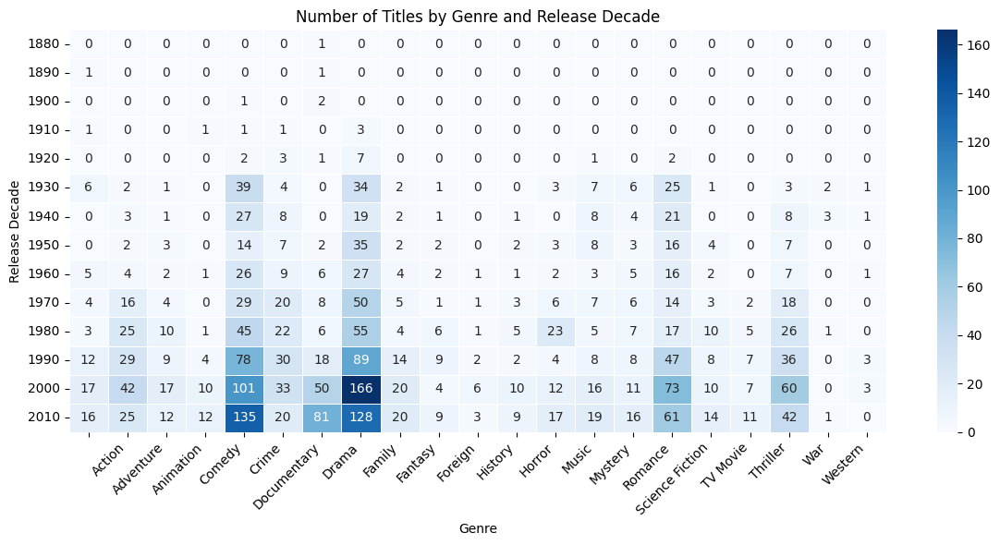
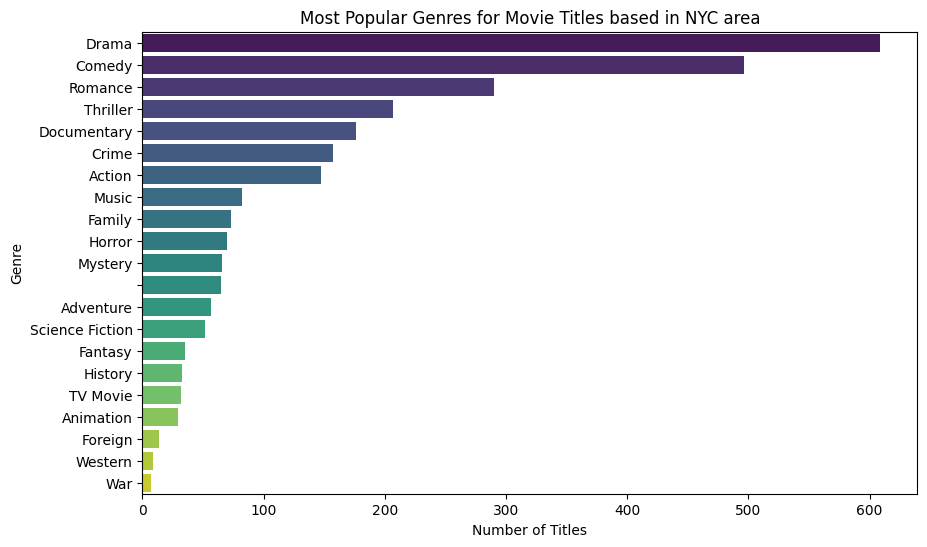

The project contains 41 cells, all of which are code cells. 
The project is focused on analyzing movie titles based on genres and release decades, particularly around the NYC area, as hinted by the code functionalities.

Project title 
Movies set in or about NYC area.

Overview
This project conducts a detailed analysis of movie titles, focusing on genres and their popularity over different decades. The goal is to identify trends in movie genres and understand their evolution through time.

Getting Started

Dependencies
To run this project, you need to have the following libraries installed:

Pandas
Matplotlib
re
json
You can install these dependencies via pip:
pip install pandas matplotlib re json

Installation
Clone the repository to your local machine:

git clone <https://github.com/Karolina-Szafranska/NYC_movies>
Navigate to the project directory:

cd <project-directory>
Usage
Execute the notebook to perform the analysis:

jupyter notebook project_1.ipynb
Key Functionalities

Filtering titels and overview to search for movies set in or about NYC area.
Grouping movie titles by release decade and genre.
Counting the number of unique titles for each genre and release decade combination.
Visualizing the most popular genres.
Binning data by decades and providing decade range labels.
Data Requirements

The project requires movie data with at least the following fields: title, genre, and release year. The analysis includes binning the data by decades and assigning appropriate labels.

Output

The primary output is a set of visualizations that showcase the most popular genres for movie titles based in the NYC area, alongside a decade-wise distribution.

